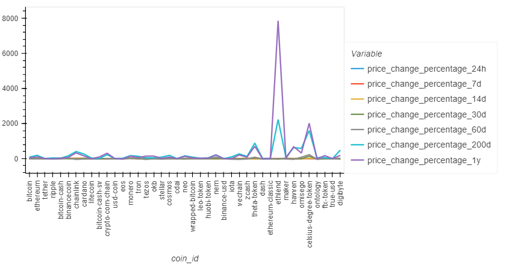
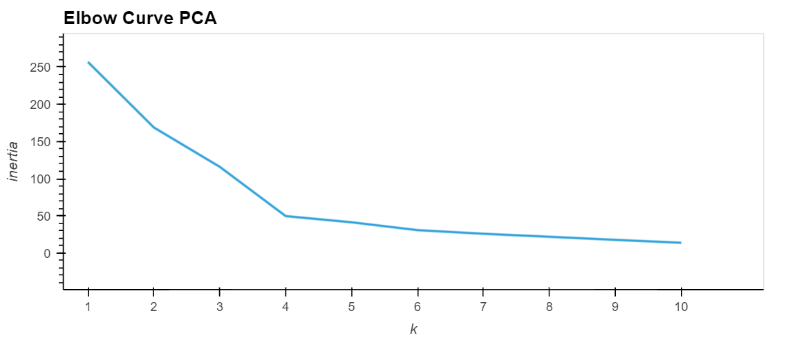

# CryptoClustering
In this challenge, Python and unsupervised learning techniques were used to predict if cryptocurrencies are affected by 24-hour or 7-day price changes.

# Libraries and Dependencies Used
* **Libraries:** Pandas, hvplot and NumPy
* **Dependencies** sklearn for KMeans, PCA and StandardScaler

# Steps
1. View Market Data

2. Find the best value for k-means by using the original data
* The best value for k when using the original data: 4

3. Cluster the cryptocurrencies with K-means using the original scaled data

4. Optimize clusters with Principal Component Analysis (PCA) 
* The total explained variance ratios: 89%

5. Find the best value for k by using the PCA data
* The best value for k when using the PCA data: 4

6. Cluster the cryptocurrencies with k-means using the PCA data

7. Visualize and Compare the Results (Note: Please visit the Crypto_Clustering.ipynb file to see the full charts)

# Results
  * The best value for k was 4 for both cases. 

  * Using fewer features in K-Means clustering can make it easier to understand the groups in the data. However, this might oversimplify the information and leave out important details. So, while it makes the analysis simpler, it may not show all the intricacies and complexities in the original data.